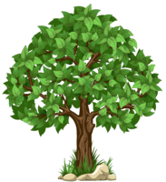

# This Forrest Favicon Package

**Package was generated with [RealFaviconGenerator](https://realfavicongenerator.net/)**

## Install instructions

**To install this package:**

**Place the content of this package in a folder of your choice.**

**Insert the following code in the `head` section of your pages, make sure to add the right path to the content folder:**

    <link rel="apple-touch-icon" sizes="180x180" href="../images/favicon_package_forrest/apple-touch-icon.png">
    <link rel="icon" type="image/png" sizes="32x32" href="../images/favicon_package_forrest/favicon-32x32.png">
    <link rel="icon" type="image/png" sizes="16x16" href="../images/favicon_package_forrest/favicon-16x16.png">
    <link rel="manifest" href="../images/favicon_package_forrest/site.webmanifest">
    <link rel="mask-icon" href="../images/favicon_package_forrest/safari-pinned-tab.svg" color="#00A300">
    <meta name="msapplication-TileColor" content="#00a300">
    <meta name="theme-color" content="#FFFFFF">
